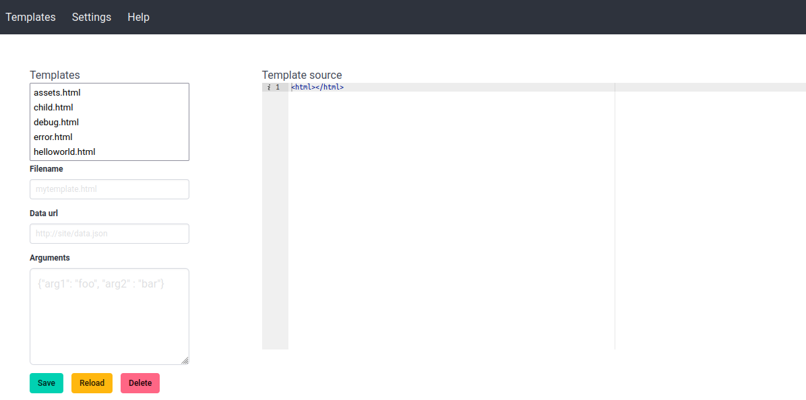

# template-designer

A template designer tool for [Djula](http://mmontone.github.io/djula/djula/).



## Introduction

`template-designer` is a web application for creating, editing and rendering Djula templates. 

## Settings

- **project-directory**: The root directory of the project. If not specified, then `*default-pathname-defaults*/<project-name>/` is used.
- **templates-directory**: The directory where the template files are stored. If not specified, then <project-directory>/templates/ is used as directory.
- **config-directory**: The directory where template configuration is stored. Template configuration has arguments and data urls for the templates. If not specified, then <project-directory>/templates-config/ is used.
- **assets-directory**: The directory where web assets (like images) are stored. If not specified, then <project-directory>/assets/ is used.
- **template-files-pattern**: Pattern for listing the template files from the templates directory. By default, all files are listed. Example value: *.html

## Working with the template designer

Templates are listed on the left. Their source can be edited on the right.
The render template appears at the bottom.

Arguments for templates can be specified either providing a `Data url` or filling in the `Arguments` text area. The arguments text area supports both JSON and Lisp data expressions.

To create a template, click on the `Templates` in the menubar, then enter a filename and click on `Save`.

To render a template, click on `Save`.

To clone a template, click on an existing template, then change the filename and save.

## Demo

To run a demo, evaluate:

```lisp
(ql:quickload :template-designer-demo)
(template-designer-demo:start)
```

## Running

```lisp
(ql:quickload :template-designer)
```

Then invoke `template-designer:start` with the project name and settings.

## Q&A

### How to create new templates?

Click on the `templates` menu. Then fill the `Filename` form field with a filename for the template. Edit the template source and click on `Save` button.

### How to work with an alternative template editor?

Open the template from the filesystem user your editor of choice. The directory with the templates is shown in the `Settings` page.

With your editor of choice, edit the template and save. Then, from template-designer interface, click on `Reload` to visualize the rendered template.

An alternative is to first click on `Open in new tab` to visualize your template. Then edit the template file using your editor of choice and hit the web browser reload button to visualize the rendered template.

### How to access assets?

Assets are stored in the **assets-directory** (can be inspected from `Settings` page), and accessed using `/assets/<filename>` url.
