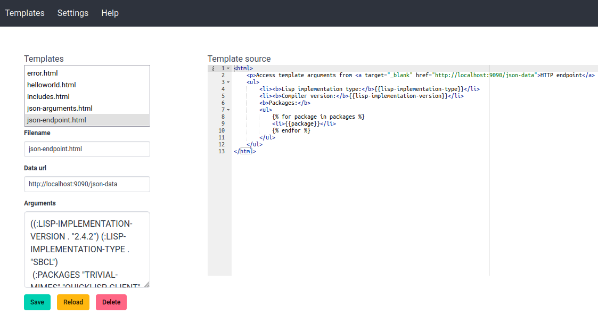

# template-designer

A template designer tool for [Djula](http://mmontone.github.io/djula/djula/).



## Introduction

`template-designer` is a web application for creating, editing and rendering Djula templates. 

## Settings

- **project-directory**: The root directory of the project. If not specified, then `*default-pathname-defaults*/<project-name>/` is used.
- **templates-directory**: The directory where the template files are stored. If not specified, then <project-directory>/templates/ is used as directory.

## Demo

To run a demo, evaluate:

```lisp
(ql:quickload :template-designer-demo)
(template-designer-demo:start)
```

## Running

```lisp
(ql:quickload :template-designer)
```

Then invoke `template-designer:start` with the project name and settings.

## Q&A

### How to create new templates?

Click on the `templates` menu. Then fill the `Filename` form field with a filename for the template. Edit the template source and click on `Save` button.

### How to work with an alternative template editor?

Open the template from the filesystem user your editor of choice. The directory with the templates is shown in the `Settings` page.

With your editor of choice, edit the template and save. Then, from template-designer interface, click on `Reload` to visualize the rendered template.

An alternative is to first click on `Open in new tab` to visualize your template. Then edit the template file using your editor of choice and hit the web browser reload button to visualize the rendered template.
